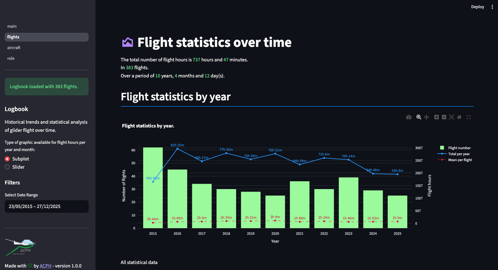

# 📔 GivavLens

Turn your Smart'Glide logbook into visual insights. This streamlit web  application connects to the Givav platform (or accepts `givav-scrape` CSV exports) to track your soaring progress. Visualize your flying history through interactive charts, compare aircraft usage, and analyze your training sessions with specific instructor-level statistics.



## Quick overview

- App entry / UI: `main.py` — upload a CSV or sync with Smart'Glide (Givav). The app stores the parsed DataFrame in `st.session_state['logbook']` and pages under `pages/` use that session data.
- CSV parsing & utilities: `glider_utils.py` — parsing, `Durée` → timedelta conversion, and aircraft normalization.
- Givav scraper CLI: `givav/scrape.py` (console entry `givav-scrape` from `setup.py`).
- Pages: `pages/0_flights.py`, `pages/1_aircraft.py`, `pages/2_role.py` (Streamlit pages that read `st.session_state['logbook']`).

## Requirements

- Python 3.11
- See `requirements.txt` for runtime dependencies (Streamlit, pandas, plotly, beautifulsoup4, requests, click, ...)

## How to run this app locally with python 3

1. Clone the repository and create a virtual environment:

```bash
git clone https://github.com/tfraudet/givav-lens.git
cd givav-lens
python3 -m venv .venv
source .venv/bin/activate
pip install -r requirements.txt
```

2. Run the app

```bash
streamlit run main.py
```

## CSV format (expected)

- Semicolon-separated (`;`).
- Required / expected columns (example order):

  Date;Immat.;Type;Catégorie;Fonc.;Nat.;Lanc.;Décol.;Durée;Montagne;Lieu;Commentaire;Club;Abréviation;Nom

- `Date`: DD/MM/YYYY
- `Durée`: HH:MM (e.g. `00:45`) — this column is converted to a pandas `timedelta` by `glider_utils.make_delta()` and stored as `Durée` (timedelta) in the DataFrame.

Example row:

```bash
16/10/2022;F-CJDT;JANUS C;Planeur;Cdt;Loc;R;14:33;00:45;NON;LFHA-Aérodrome d'Issoire - Le Broc;;836301;ISSOIRE ACPH;Aéro-club Pierre Herbaud
```

## Givav scraper (Smart'Glide)

Extracting flights data from Givav Smart Glide website requires user credentials. The CLI `givav-scrape` logs in to the Givav website, navigates to the logbook page, and scrapes the flight data as CSV.

- Install locally to expose the console command:

```bash
pip install --editable .
```

- Example usage:

```bash
# write CSV to file (uses -o/--output)
givav-scrape --user YOUR_USER --password YOUR_PASS -o my-export.csv

# or print to stdout
givav-scrape --user YOUR_USER --password YOUR_PASS

# help
givav-scrape --help
```

## Troubleshooting

- Empty graphs: ensure the CSV is semicolon-separated and `Durée` values are in `HH:MM` format.
- Parser errors: open the CSV in a text editor and confirm the separator and date formats match expectations (dayfirst). The parser uses day-first parsing.
- Givav sync failures: verify credentials and network access. If scraping fails, try running `givav-scrape` from the command line to see raw output.

## Development notes

- To add or normalize aircraft names, update the mapping in `glider_utils.py`.
- Streamlit multi-page pattern: pages read the shared `st.session_state['logbook']` — avoid reloading CSVs in pages to keep consistent state.

## Contributing

- Feel free to add pages under the `pages/` directory for additional statistics and visualizations.

## License

- This project is licensed under the MIT License — see [LICENSE](LICENSE) for details.
